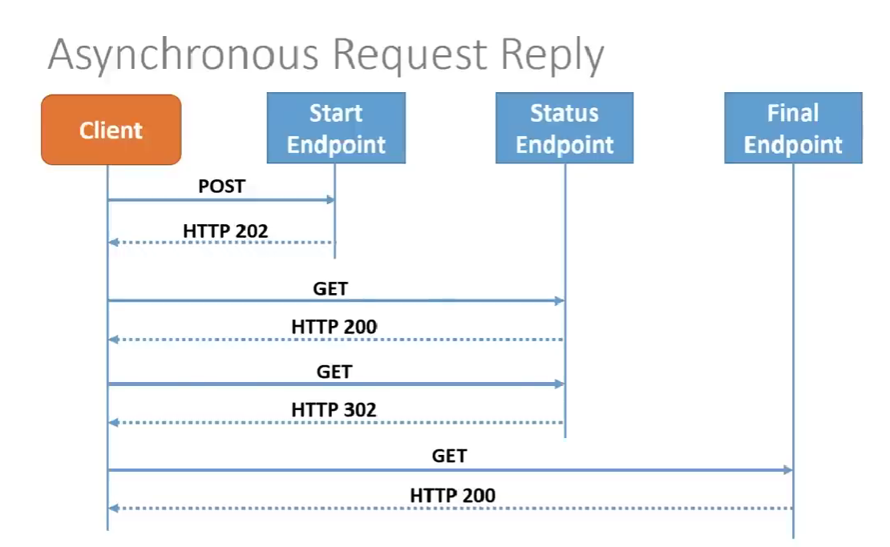
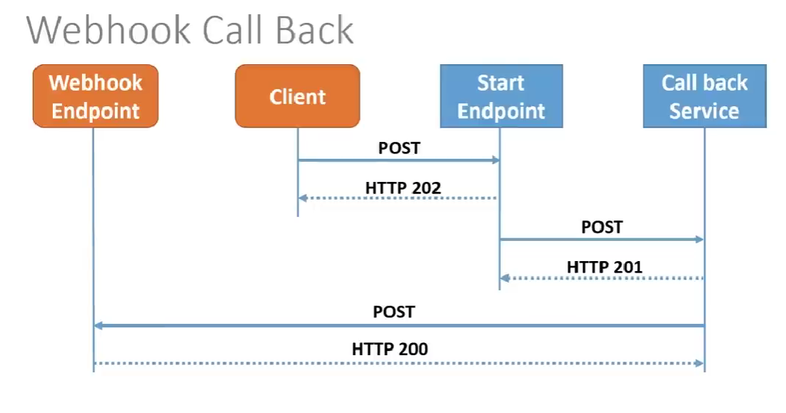
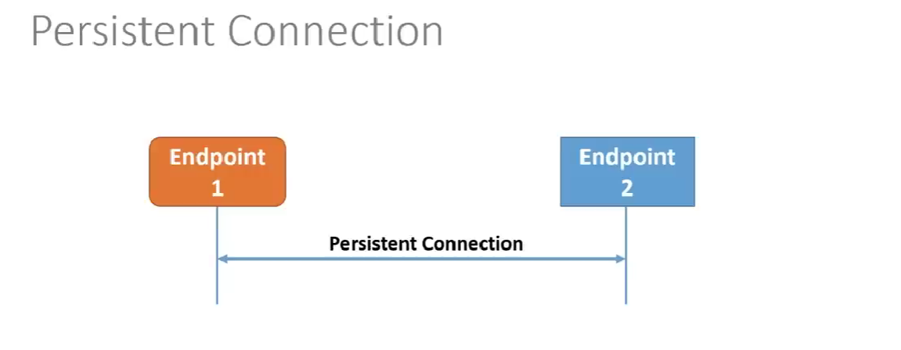

# Asynchronous Request-Reply Pattern

A short summary of the Asynchronous Request-Reply pattern (Azure Architecture Center), plus how it differs from broker-based request-reply as described in AsyncAPI.

## Problem

Most APIs answer within about 100 ms, so the response can return over the same HTTP connection. Some back ends do long-running work (seconds to minutes), so the client cannot wait for the result on that connection. The front end still needs a clear answer once the work finishes.

## Solution: HTTP polling

1. The client sends a request (for example `POST /jobs`).
2. The API validates the request. If it is invalid, it replies immediately with `400 Bad Request`.
3. If it is valid, the API replies right away with `202 Accepted` and these headers:
   - `Location`: the status endpoint the client should poll.
   - `Retry-After`: the suggested polling interval.
4. The API hands the work to a background component, such as a message queue and a worker.
5. The client polls the status endpoint with `GET`:
   - While the work is running, it returns `200 OK` with a status body.
   - When the work is done, it returns `303 See Other` pointing to the result.
6. The client sends `GET` to the result URL and receives `200 OK` with the data.

```
Client            API / Status endpoint      Queue + Worker        Result store
  | -- POST ---------> |                          |                    |
  |                    | -- enqueue ------------> |                    |
  | <-- 202 + Location |                          |                    |
  |                    |                          | -- save result --> |
  | -- GET status ---> |                          |                    |
  | <-- 200 (running)  |                          |                    |
  | -- GET status ---> |                          |                    |
  | <-- 303 + Location |                          |                    |
  | -- GET result ------------------------------------------------->   |
  | <-- 200 + data ------------------------------------------------    |
```

## Key considerations

- **Use 303, not 302.** `303 See Other` forces the client to use `GET` on redirect. Some clients replay the original method on `302`, which can create duplicate `POST` requests.
- **Dedicated status endpoint.** Polling the target resource directly and waiting for it to stop returning `404` is ambiguous, because an invalid request ID also returns `404`.
- **Status response fields.** Consider `status` (Pending, Running, Succeeded, Failed, Canceled), `createdAt`, `lastUpdatedAt`, optional `percentComplete`, and a structured `error` (RFC 9457 format).
- **Errors.** Persist the error at the result URL and return a matching `4xx` status with a structured body.
- **Idempotency.** Ask clients to send an `Idempotency-Key` header. If the server sees a duplicate key, it returns the existing status resource instead of queueing a second job.
- **Cancellation.** Expose `DELETE` on the status resource to cancel a running job. Decide whether partial rollback or a compensating transaction is needed.
- **Retention.** Status and results use storage, so define a cleanup policy. An `Expires` header can tell clients how long the result stays available.
- **Access control.** The `Location` URL can be a SAS token. The Valet Key pattern works well when the result needs controlled access.
- **Legacy clients.** If a client cannot handle this pattern, put a facade in front of the async API (for example Azure Logic Apps) to hide the asynchronous behavior.
- **Long polling.** The server can hold the connection open until data is ready or a timeout occurs. This lowers latency but adds connection-management complexity.

## When to use

- The client is browser-based or otherwise cannot expose a callback endpoint.
- Firewall restrictions prevent the service from calling back the client.
- WebSockets or webhooks are not available.

## When it may not fit

- A service built for notifications (such as Azure Event Grid) is available.
- Results must stream in real time. Consider Server-Sent Events.
- The client needs many results with low latency. Consider a message broker.
- Persistent connections (WebSockets, SignalR) are available.
- The network allows open ports for webhooks or callbacks.

## Comparison: HTTP polling vs. broker request-reply (AsyncAPI)

|                                | HTTP polling (Azure pattern)              | Broker request-reply (AsyncAPI)          |
| ------------------------------ | ----------------------------------------- | ---------------------------------------- |
| Transport                      | HTTP/REST directly                        | Message broker (Kafka, RabbitMQ, etc.)   |
| How the client gets the result | Client polls a status endpoint            | Reply arrives on a `replyTo` channel     |
| Correlation                    | `requestId` inside the `Location` URL     | `correlationId` in the message header    |
| Best for                       | Browsers, HTTP-only clients, no callbacks | Service-to-service, event-driven systems |

### In this sourcecode, it's built rely on HTTP Polling

## Async Request-Reply (current)



## Webhook



## Persistent



## Source

- [Asynchronous Request-Reply pattern, Azure Architecture Center](https://learn.microsoft.com/en-us/azure/architecture/patterns/asynchronous-request-reply)
